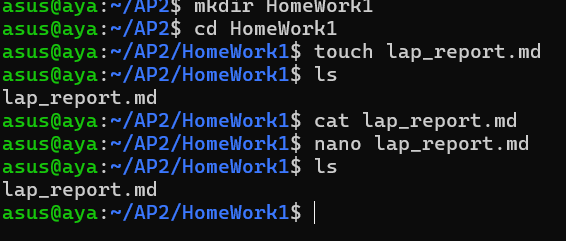

Lab Report
1 : Important Commands :
pwd
ls
ls -la
cd
mkdir
cp
mv
rm
cat
head -n
tail -n
grep
printf
wc
echo
source
ecport
cat
cut
2 : Git Commands :
git init
git add .
git commit -m "..."
git log --oneline
./scripts/report.shShort Assessment Questions
ما الفرق بين > و >> و &> ؟

>
يستخدم لتحويل المخرجات العادية (stdout) إلى ملف مع استبدال أي محتوى قديم داخل الملف.

>>
يشبه > لكن بدل الاستبدال يقوم بإضافة المحتوى الجديد إلى نهاية الملف.

&>
يستخدم لتحويل المخرجات العادية ورسائل الأخطاء (stderr) معًا إلى نفس الملف.

متى نستخدم source بدل ./script.sh ؟
نستخدم source عندما نريد تنفيذ السكريبت داخل نفس جلسة الـ shell الحالية حتى تبقى المتغيرات أو الإعدادات مفعلة بعد انتهاء التنفيذ.
أما ./script.sh فيشغل السكريبت ضمن جلسة فرعية مستقلة، لذلك أي متغيرات يتم إنشاؤها تختفي بعد انتهاء السكريبت.

ما الفرق بين && و  ؟

&&
يجعل الأمر الثاني يعمل فقط إذا تم تنفيذ الأمر الأول بنجاح.

يجعل الأمر الثاني يعمل فقط في حال فشل الأمر الأول.

لماذا نستخدم الفروع (Branches) في Git؟
الفروع تساعد على تطوير ميزات أو تجربة تعديلات جديدة بدون التأثير على النسخة الأساسية من المشروع.
كما أنها تسهّل التعاون بين أعضاء الفريق وتسمح بمراجعة التعديلات قبل دمجها مع المشروع الرئيسي.

ما وظيفة ssh-agent ؟
ssh-agent مسؤول عن إدارة مفاتيح SSH وتخزينها مؤقتًا أثناء الجلسة.
هذا يسمح باستخدام المفاتيح للاتصال بالخوادم أو GitHub بدون الحاجة لإعادة كتابة كلمة المرور في كل مرة.

